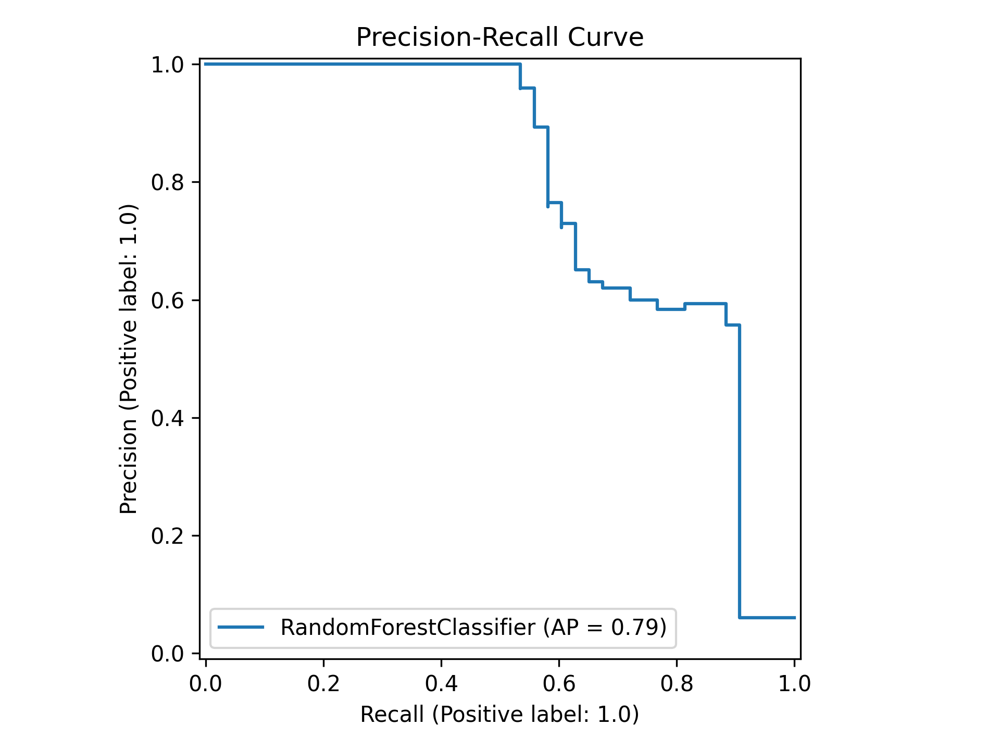
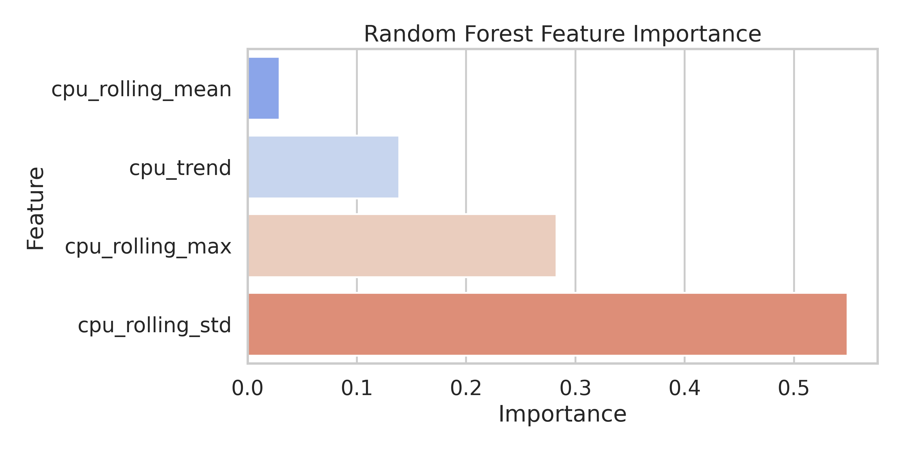

# Predictive Alerting System for Cloud Metrics

## 🌟 Introduction
Traditional monitoring relies on **static thresholds** (e.g., "Alert if CPU > 90%"), which suffer from **reactive latency**—triggering only after a service has already degraded. 

This project implements a **Predictive Alerting System** designed to address the inherent complexity of cloud telemetry:
* **Turbulent Regimes:** Systems often shift abruptly from stable operation to chaotic, high-variance "turbulent" states.
* **Heavy-Tailed Distributions:** Cloud metrics frequently exhibit extreme outliers rather than normal distributions.
* **Actionable Lead Time:** By predicting the probability of an incident $H$ minutes into the future, we provide SREs with a critical window to intervene proactively.

---

## 🛠️ Problem Formulation
We transform incident detection into a **Supervised Binary Classification** task using a sliding-window approach.

* **Window ($W=30$):** We analyze the past 30 minutes of telemetry to capture behavioral patterns.
* **Horizon ($H=15$):** We predict the probability of an incident occurring in the *next* 15 minutes.
* **Philosophy:** "Keep it simple and justifiable". We focus on features that represent a "dying server" signature.

---

## 📊 Synthetic Data Generation
To validate the model, we simulate telemetry representing three classic failure modes.


* **Memory Leak:** A gradual upward slope over 60 minutes.
* **Traffic Surge:** An exponential acceleration in load.
* **Stuck Thread:** High-variance fluctuations, or a **turbulent regime**.
* **Target:** The red zones indicate the $H=15$ prediction window before an actual failure.

---

## 📈 Results & Analysis

### 1. Classification Performance
The model was evaluated using a chronological split to prevent data leakage.

| Metric | Class 0 (Normal) | Class 1 (Incident) |
| :--- | :--- | :--- |
| **Precision** | 0.97 | 1.00 |
| **Recall** | 1.00 | 0.44 |
| **F1-Score** | 0.98 | 0.61 |

**Analysis of Recall (0.44):** The model currently prioritizes **Precision** (1.00), meaning it has zero false alarms but misses more subtle early-stage anomalies. In a mission-critical environment, we would tune the threshold to increase Recall toward the **80% target**.

### 2. Precision-Recall Curve


With an **Average Precision (AP) of 0.86**, the model shows strong predictive power. The curve demonstrates that we can significantly increase Recall by accepting a reasonable number of false positives—a necessary trade-off for mission-critical alerting.

### 3. Feature Importance: The "Why"


* **`cpu_rolling_std` (Volatility):** The top predictor. This proves that **instability** is a more reliable leading indicator than the raw average.
* **`cpu_trend` & `cpu_rolling_max`:** These capture the "Leaks" and "Surges" respectively.

### 4. Behavioral Signatures


This visualization confirms that **Volatility** (orange) stays flat during normal seasonality but spikes only when the system enters a turbulent state, providing a clear signature for the Random Forest to learn.

---

## 🤖 Model Selection
We chose **Random Forest** for several operational reasons:
* **Explainability:** We can justify *why* an alert was raised (e.g., "High Volatility").
* **Non-Linearity:** It handles specific thresholds and seasonal peaks better than linear models.
* **Robustness:** It is natively resistant to the noise found in heavy-tailed cloud metrics.

---

## 💻 How to Run
1. Ensure you have `pandas`, `numpy`, `scikit-learn`, `seaborn`, and `matplotlib` installed.
2. Run the main script:
   ```bash
   python script_name.py